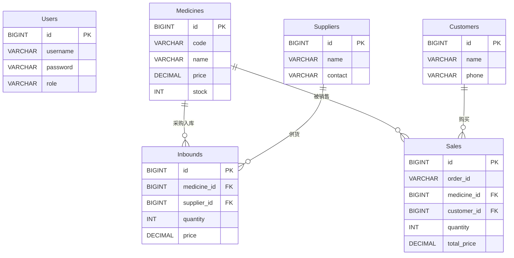

# 数据库技术文档

本项目将数据库视为应用的核心逻辑层，而非简单的存储介质。通过深度集成高级特性，实现了数据的一致性校验和高效聚合。

## 📊 数据字典与实体关系

### 1. 实体关系图 (ER Diagram)

### 2. 详细数据字典

#### (1) Users (员工/管理员表)
| 字段名 | 类型 | 约束 | 说明 |
| :--- | :--- | :--- | :--- |
| `id` | BIGINT | PK, Auto Increment | 用户唯一标识 |
| `username` | VARCHAR(50) | Unique, Not Null | 登录用户名 |
| `password` | VARCHAR(255) | Not Null | 加密后的密码 (Bcrypt) |
| `role` | VARCHAR(20) | Default 'staff' | 角色权限: 'admin' / 'staff' |
| `created_at` | TIMESTAMP | Default Current | 创建时间 |

#### (2) Medicines (药品信息表)
| 字段名 | 类型 | 约束 | 说明 |
| :--- | :--- | :--- | :--- |
| `id` | BIGINT | PK, Auto Increment | 药品唯一标识 |
| `code` | VARCHAR(50) | Unique, Not Null | 药品条形码/编码 |
| `name` | VARCHAR(100) | Not Null | 药品通用名称 |
| `type` | VARCHAR(20) | Not Null | 类别 (处方药/OTC等) |
| `spec` | VARCHAR(50) | - | 规格 (e.g. 10g*10袋) |
| `price` | DECIMAL(10,2) | Not Null | 零售单价 |
| `stock` | INT | Default 0 | 当前实时库存 |
| `manufacturer` | VARCHAR(100) | - | 生产厂家 |
| `status` | VARCHAR(20) | Default 'active' | 状态 (active/discontinued) |

#### (3) Customers (客户表)
| 字段名 | 类型 | 约束 | 说明 |
| :--- | :--- | :--- | :--- |
| `id` | BIGINT | PK, Auto Increment | 客户ID |
| `name` | VARCHAR(100) | Not Null | 客户姓名 |
| `phone` | VARCHAR(20) | - | 联系方式 |

#### (4) Suppliers (供应商表)
| 字段名 | 类型 | 约束 | 说明 |
| :--- | :--- | :--- | :--- |
| `id` | BIGINT | PK, Auto Increment | 供应商ID |
| `name` | VARCHAR(100) | Not Null | 供应商企业名称 |
| `contact` | VARCHAR(50) | - | 联系人姓名 |
| `phone` | VARCHAR(20) | - | 联系电话 |

#### (5) Inbounds (入库记录表)
| 字段名 | 类型 | 约束 | 说明 |
| :--- | :--- | :--- | :--- |
| `id` | BIGINT | PK, Auto Increment | 流水号 |
| `medicine_id` | BIGINT | FK -> Medicines.id | 关联药品 |
| `supplier_id` | BIGINT | FK -> Suppliers.id | 关联供应商 |
| `quantity` | INT | Not Null | 入库数量 |
| `price` | DECIMAL(10,2) | Not Null | 进货单价 (成本) |
| `inbound_date` | TIMESTAMP | Default Current | 入库时间 |

#### (6) Sales (销售记录表)
| 字段名 | 类型 | 约束 | 说明 |
| :--- | :--- | :--- | :--- |
| `id` | BIGINT | PK, Auto Increment | 记录流水号 |
| `order_id` | VARCHAR(50) | Not Null | 业务订单号 (支持多品合单) |
| `medicine_id` | BIGINT | FK -> Medicines.id | 关联药品 |
| `customer_id` | BIGINT | FK -> Customers.id | 关联客户 |
| `quantity` | INT | Not Null | 销售数量 |
| `total_price` | DECIMAL(10,2) | Not Null | 交易总金额 (单价*数量) |
| `sale_date` | TIMESTAMP | Default Current | 交易时间 |

### 3. 范式设计说明
系统整体遵循 **BCNF (Boyce-Codd Normal Form)**：
- 无函数依赖冲突，所有非码属性完全依赖于码。
- 通过在业务主表引入 `order_id` 确保了业务可追溯性，同时在逻辑上将其解耦以提升查询性能。

## ⚙️ 数据库高级逻辑实现

### 1. 触发器 (Triggers): 自动化同步
- **库存闭环控制**：
    - 插入销售记录时扣减库存 (`tr_after_sale_insert`)。
    - 插入入库记录时增加库存 (`tr_after_inbound_insert`)。
    - 删除异常订单或记录时，自动回滚库存 (`tr_after_sale_delete`, `tr_after_inbound_delete`)。
- **严格校验**：
    - `tr_before_sale_check_stock`：在物理层拦截非法超支销售，确保库存 `stock` 永不为负。

### 2. 存储过程 (Stored Procedures): 复杂逻辑封装
存储过程承担了系统中 90% 的统计分析工作：
- **搜索优化**：`sp_search_medicines` 支持多字段模糊匹配与服务器端分页。
- **报表分析**：
    - `sp_sales_trend`：执行跨表聚合，计算指定时间段内的营收与毛利润。
    - `sp_top_selling_medicines`：实现动态列排序的排行榜逻辑，将排序负担移至数据库引擎。
- **原子业务**：`sp_update_sale` 封装了库存回滚、重算金额、新库存扣减等一系列操作，确保业务逻辑的一致性。

### 3. 视图 (Views): 数据封装与安全
- **权限隔离**：
    - `v_staff_medicines`：作为对普通员工暴露的数据接口，屏蔽了成本价字段。
- **报表抽象**：
    - `v_admin_financials`：预先聚合每日财务现状，后端只需执行简单的 `SELECT` 即可获取关键指标。

## 🛠️ 部署与维护
- **脚本分工**：
    - `init.sql`：定义 DDL 结构。
    - `advanced_features.sql`：单独维护所有 SP、Trigger 和 View。
    - `seed.sql`：提供高质量的测试数据，用于模拟真实销售环境。
